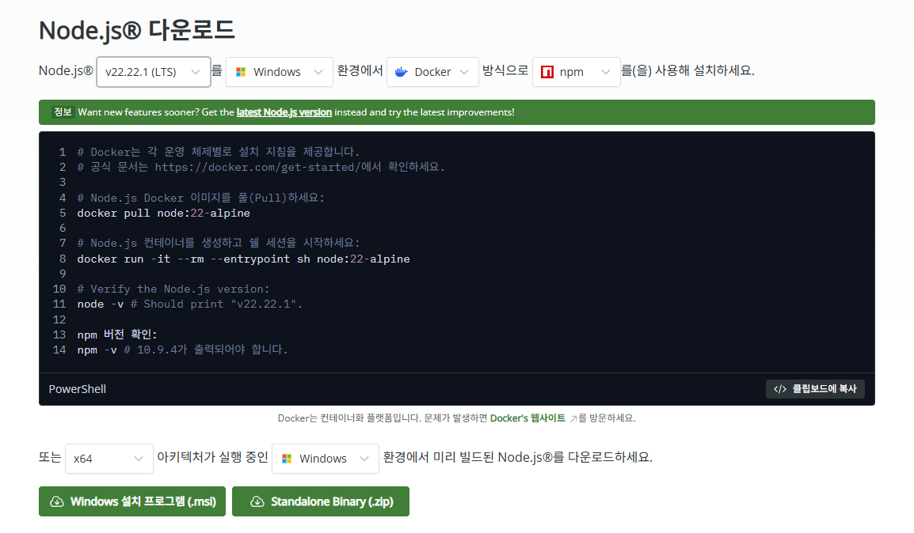

# Gemini CLI Portable

이 프로젝트는 Google의 **Gemini 개발자용 CLI(@google/gemini-cli)** 를 데스크탑 환경이나 호스트 PC에 어떠한 흔적도 남기지 않고, USB나 외장 하드에서 **완벽하게 포터블(Portable)로 구동**하기 위해 만들어졌습니다.

또한 샌드박스 제한을 패치로 우회하여, 호스트 PC의 어떤 경로든 자유롭게 읽고 쓸 수 있도록 확장되었습니다.

## 1. 요구 사항 및 환경 구성

새로운 환경에서 구동하기 전, 아래 두 폴더를 프로젝트 루트에 준비해 주세요.


- **Node.js (node/ 폴더)**:
  - **링크**: https://nodejs.org/ko/download
  - **버전**: v20 이상 권장 (이미지대로, .zip파일로 다운로드)
  - **위치**: `D:\gemini-Cli\node\` (프로젝트 루트 내 `node` 폴더)
  - **구성**: `node.exe`, `npm`, `npx` 등이 포함된 포터블 바이너리 전체
- **Python (python/ 폴더)**:
  - **링크**: https://www.python.org/downloads/windows/
  - **버전**: v3.13 이상 권장 (Windows embeddable package)
  - **위치**: `D:\gemini-Cli\python\` (프로젝트 루트 내 `python` 폴더)
  - **구성**: `python.exe` 및 `Scripts` 폴더가 포함된 포터블 파이썬 전체

## 2. MCP 서버 구동 방법

프로젝트에 포함된 MCP 서버들은 최초 실행 시 각각의 의존성을 설치해 줘야 합니다.
MCP가 잘 연동되었는지 CLI 실행 시 /MCP 실행을 통해 확인 가능합니다.

### github-server (Node.js)
1. `MCP/github-server` 디렉토리로 이동합니다.
2. `../../node/npm install` 명령어를 실행하여 필요한 패키지를 설치합니다.

### Office-Word-MCP-Server (Python)
1. `MCP/Office-Word-MCP-Server` 디렉토리로 이동합니다.
2. `../../python/python.exe setup_mcp.py`를 실행하거나, `pip install -e .`를 통해 환경을 구성합니다.

### npx 기반 서버 (최초 실행 시 /cache 디렉토리에 자동 생성(최초실행시 속도지연됨))
이 서버들은 별도의 수동 설치 없이, Gemini CLI에서 해당 도구를 처음 호출할 때 `npx`를 통해 자동으로 내려받아 실행됩니다.

- **chrome-devtools**: Chrome 브라우저의 개발자 도구와 연동하여 브라우저 자동화 및 페이지 분석 기능을 제공합니다.
- **browsermcp**: 웹 브라우저를 직접 제어하여 복잡한 웹 페이지와 상호작용하고 데이터를 추출합니다.
- **fetch**: 다양한 웹 사이트의 내용을 읽어오거나, 읽기 좋은 마크다운 형식 등으로 변환하여 가져옵니다.
- **playwright**: 최신 웹 브라우저 엔진을 활용한 강력한 자동화 및 스크린샷, 웹 테스트 기능을 수행합니다.
- **kubernetes**: 쿠버네티스 클러스터와 연동하여 파드(Pod), 서비스 등 리소스를 조회하고 관리합니다.

## 3. 프로젝트 구조 (Project Tree)

```text
D:\gemini-Cli\
├── node\               # Node.js 포터블 런타임 (사용자 준비)
├── python\             # Python 포터블 런타임 (사용자 준비)
├── config\             # 설정 및 사용자 프로필 데이터
│   └── .gemini\        # Gemini CLI 전용 설정 (GEMINI.md, settings.json 등)
├── MCP\                # Model Context Protocol 서버 모음
│   ├── github-server   # GitHub 연동 서버
│   └── Office-Word-MCP-Server # 워드 문서 제어 서버
├── node_modules\       # Gemini CLI 코어 및 종속성 (자동 생성)
├── start-gemini.bat    # 포터블 환경 실행 진입점
├── patch-sandbox.js    # 샌드박스 우회 런타임 패치 스크립트
├── package.json        # 프로젝트 의존성 명세
└── README.md           # 현재 문서
```

## 4. 실행 방법

1. `node/`와 `python/` 폴더가 준비되었는지 확인합니다.
2. **`start-gemini.bat`** 파일을 실행합니다.
3. 최초 실행 시 `npm install` 및 `patch-sandbox.js`가 자동으로 적용되며 Gemini CLI가 구동됩니다.

## 5. 주의 사항
- **보안**: `config/.gemini/settings.json`에는 API 키가 포함되어 있습니다. 공유 시 반드시 `settings.example.json` 등으로 대체하거나 제외하세요.
- **권한**: `patch-sandbox.js`는 파일 시스템 보호를 해제하므로, 신뢰할 수 있는 프롬프트만 실행하시기 바랍니다.
